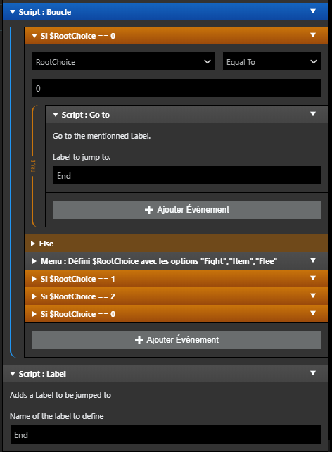

# Plugins for GBStudio 3.0

More plugins :

- https://github.com/pau-tomas/gb-studio-plugins
- https://github.com/Y0UR-U5ERNAME/gbs-plugin-collection

## Goto & Label 

Use them to jump anywhere in a program. Let's be honest, this probably should only be used to break from a loop.

